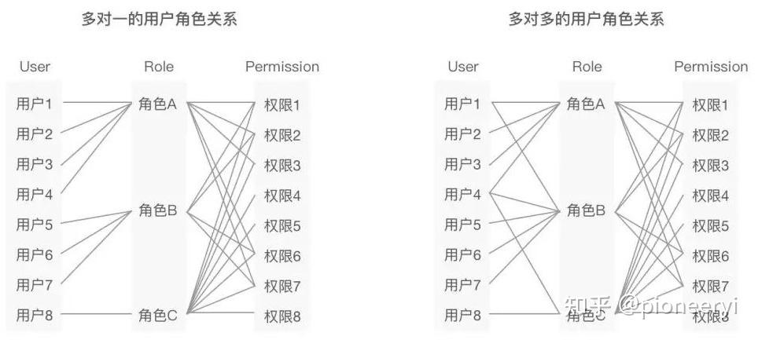

# pms 统一权限管理系统

## 介绍
> 统一权限管理系统旨在为企业提供统一的权限管理解决方案，帮助企业快速构建自己的权限系统。相信在任何一家企业中，都会有许多不同的管理系统，如 OA，CRM，ERP 等。
> 而每个系统都有自己的用户管理、权限管理、组织管理等模块。如果企业有多个系统，那么企业就需要维护多个系统，并且每个系统都需要进行权限管理、角色分配等。而且这些
> 系统可能存在不同的技术栈，如 OA 是 Java 开发的，而 CRM 是 PHP 开发的。但是企业可能希望统一管理所有系统，并且统一权限分配。这时，统一权限管理系统就应运而生。

## 基于角色的权限管理模型
在业界接受度较高的权限模型是RBAC(Role-Based Access Control),基本的概念是将“角色”这个概念赋予用户，在系统中用户通过分配角色从而获得相应的权限，一个用户可以有多个角色，一个角色可以有多个权限，从而实现权限的灵活配置。

### 基本的RBAC模型
最基本的RBAC模型，就是由“用户”，“角色”以及“权限”这三个主体组成，一个用户可以有多个角色，一个角色可以有多个权限，他们之间的关系可以是多对一关系，也可以是多对多关系。

### 引入用户组的RBAC模型
如果用户数量比较庞大，新增一个角色时，需要为大量用户都重新分配一遍新的角色，工程量巨大，此时可以引入用户组的概念。如果部分用户的使用场景是相对一致和基础的，可以把这些用户打包成一个组，基于这个组的对象进行角色和权限的赋予。最终用户拥有的所有权限 = 用户个人拥有的权限+该用户所在用户组拥有的权限。

### 角色分级的RBAC模型
在一些业务场景中，上层角色需要继承下层角色的全部权限，此时则需要使用角色继承的RBAC模型。此时除了对角色进行定义，还需要管理角色间的关系，通过关系来体现角色的层级关系，从而达到继承权限的效果。角色的继承关系主有两种：树形图和有向无环图。
继承关系常常来源于公司团队的组织架构，此时常常将角色与组织结构进行关联达到继承角色模型的效果。

### 角色限制的RBAC模型
在一些产品或系统中，部分角色可能是需要隔离的、不允许被同时赋予一个人的，比如不能既是运动员又是裁判员。因此，有些角色存在互拆关系。此外，限制还可能是数量上的，比如某个产品组中有且只有一个管理员，不允许删除或再分配其他管理员。

根据不同的业务需求，限制的形式很多，需要注意的是不能仅仅依赖后段限制，而是要在前端展示清晰的规则和恰当的限制，避免用户出错。

### 功能清单
- 租户管理：将各个需要使用权限管理的子系统当做独立的租户。
- 用户管理（租户维度）：用户登录、注册、修改密码、个人信息等。
- 组织管理（租户维度）：企业组织架构，部门、岗位等。
- 角色管理（租户维度）：角色分配、权限分配等。
- 用户组管理（租户维度）：用户组分配、角色分配等。
- 菜单管理（租户维度）：菜单分配、权限分配等。
- 权限管理（租户维度）：权限分配、角色分配等。

## 安装

## 技术选型

- 核心框架：Spring Boot 3.0.9、Spring 6.0、jdk 17、MySQL 8.0+
- 持久层框架：Mybatis、Mybatis-plus
- 数据库连接池：Druid
- 缓存框架：Redis
- 前端框架：Vue、element-ui（脚手架：vue-element-template）
- 其他：transmittable-thread-local、fastjson、lombok

## 参考
https://zhuanlan.zhihu.com/p/656534923